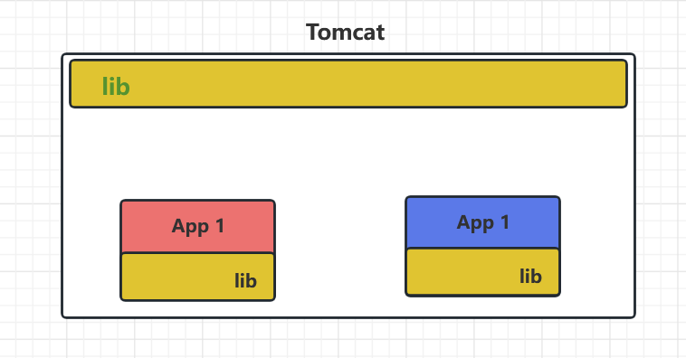

# Tomcat 为什么要打破类加载机制

对于 Tomcat 而言，它本身就是一个用 Java 实现的容器。

无法实现隔离性：

​	如果不重写类加载器，就无法实现隔离性，默认的类加载器是不管你是什么版本，只在乎你的全限定名，并且只有一份。

​	一个 web 容器可能需要部署的项目有两个或者多个，不同的应用程序，可能会依赖同一个第三方的类库的不同版本。因此为了保证每一个应用程序的类都是独立，相互隔离的。部署在同一个 web 容器中的相同的类库的相同版本可以共享，否则，会有重复的类库被加载进 JVM ，web 容器也有自己的类库，不能和应用程序的类库混淆，需要相互隔离。

无法实现热替换：jsp 文件其实也就是 class 文件，那么如果修改了，但类名还是一样，类加载器会直接取方法区中已经存在的，修改后的 jsp 是不会重新加载的。