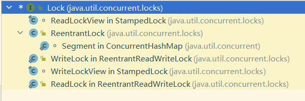

#  关于那些你可能不知道的多线程与高并发

## 锁的大白话

锁的概念其实在多线程中简单，只要满足两方面的要求就可以构成一把"锁"。

1. 该对象是唯一的
2. 该对象是被共享的

就好比一家有好几口人，只且一个大门且该大门上只有一把锁。每个人手中都有一个钥匙，而同一时间内只能有一个人才可以完成“获取锁🔒---->插入钥匙🔑--->旋转钥匙🔐----->开锁🔓” ，这一连续的动作。

直到当前的人完成这一操作后，另一个人才可以获取当前的这把锁 ，再次完成进行上述动作。

可以很明显的感受到，其实获取锁，完成打开锁的这过程中，一直都是一位锁持有者在进行操作。


其实程序的很多设计思想与理念都是从生活与现实中来的，然通过语言抽象到我们的计算机中，通过计算机去模拟我们的“生活”，所以我们的多线程原理也是与上面提到的案例是相似的。

## 你会选择什么样的锁作为对象？

无论是我们自己在实际开发环境，还是一些 Dome 中，当我们使用锁对象的时候是否考虑过关于锁对象的选择呢？

对于这个刚开始接触多线程的初学者（如笔者我一样），都会有一个直观的感受。

那当然是选择 ：

- 1️⃣ 锁对象是唯一的 

- 2️⃣ 锁对象是共享的

其实这样的选择并没有错，通过 **synchronized** 可以实现多线程下多个线程的阻塞资源锁资源争用。

但却忽略了一点细节，就是在 Java 对于中一些特殊对象规避。

对于 Java 我们都知道为了提高执行的效率，有`字符缓冲常量池`这样的一块内存区域存在的，比如我们的 String 对象，在创建以后，就会暂时的存储在常量池当中，而在某处再次调用相同的字符串的时候，就不会再进行创建直接会从常量池中取出。

 

而对于我们常用的基本类型的包装类，其实在底层对于某些常用的范围也做了处理，比如 Integer

~~~ java
/**
返回表示 Integer 指定 int 值的实例。如果不需要新 Integer 实例，则此方法通常应优先于构造函数 Integer(int)使用，因为此方法可能会通过缓存频繁请求的值来产生明显更好的空间和时间性能。此方法将始终缓存 -128 到 127（含）范围内的值，并可能缓存此范围之外的其他值。
*/
public static Integer valueOf(int i) {
        if (i >= IntegerCache.low && i <= IntegerCache.high)
            return IntegerCache.cache[i + (-IntegerCache.low)];
        return new Integer(i);
    }
~~~

那么，说了这么多。即便是会有缓冲池会指向同一个对象，这样又会有什么问题吗？

我的目的就是为了让一个对象是共享的，并且该对象的是唯一的呀。正好常量池中的对象满足以上的两点要求呀!

对的，常量池是满足了以上两点的要求，但明显它共享范围是在是太大了，对与每一个类对象都是共享的，这样就导致了一个非常严重的问题。

假设我只是想让 A 段业务逻辑中的线程 1 与 线程 2 共享 String 对象 str_1 = "卡卡罗特" ，从而实现对线程 1 与 2的并发控制。

但是我在另一个业务 B 中的线程 1 与 2 创建了新的 String 对象 str_2 = "卡卡罗特" ，像实现线程 1 与 2 的并发控制，并且业务 A 与 业务 B 之间没有任何的关联。

但是在实际任务启动的执行过程中，却发现业务 B 中的线程 1 与线程 2都无法执行，都处于等待的状态。

这其实就是因为由于业务 A 中的线程 1 与线程 2 ，业务 B 中的线程 1 与线程 2 都是的锁资源其实都是指向了同一个常量池中的对象 "卡卡罗特"，最终四个线程争夺一把锁（"卡卡罗特"）


通过一个代码进行演示

```java
package org.peggy.synchronizeds;

/**
 * 对于基本数据类型 String 类型的常量是不能做为锁对象使用的
 * 这样很可能对造成其他加载的线程出现被锁占用的情况
 * 因为 String 类型的变量会将对象存储在缓存池中
 * 而对于基本数据类型的包装类,一部分数据也做了缓存的处理
 * @author peggy
 * @date 2023-03-10 19:50
 */
public class StringSynchronized {
//    String s1 = "Hello";
//    String s2 = "Hello";

    Integer s1 = 1;
    Integer s2 = 1;

    public void getValue1() {
        synchronized (s1) {
            System.out.println("当前的线程:"+Thread.currentThread().getName());
            try {
                Thread.sleep(3000);
            } catch (InterruptedException e) {
                throw new RuntimeException(e);
            }
            System.out.println("s1==>"+s1);
        }
    }

    public void getValue2(){
        synchronized(s2){
            System.out.println("当前的线程:"+Thread.currentThread().getName());
            System.out.println("s2==>"+s2);
        }
    }

    public static void main(String[] args) {
        StringSynchronized stringSynchronized = new StringSynchronized();
        new Thread(stringSynchronized::getValue1,"t1").start();
        new Thread(stringSynchronized::getValue2,"t2").start();
    }
}
```

执行的结果如果所示


可以看到的是，尽管我们的加锁的对象是两个不同的 Integer ，但是对于 Java 底层对于 Integer 范围在 -127~128 进行了处理，所以导致了尽管我们两个线程加锁对象，表面上看是两个不同的两个对象，但是实际上指向的是常量池中的同一个对象，使得程序在运行的期间占用同一把锁。

>  所以我们在多线程的情况下不可以使用 String 以及基本类型的包装类型作为锁对象使用。

## 你有想过为什么 synchronized 是可以重入锁吗？

相比于 Lock 的细致绵柔我更喜欢 synchronized  的简单粗暴。如果要有非要有一个具体的原因，我会说。synchronized 两个字，方便，方便，简单，还TM 的是简单。。。

其实在我接触到 Lock 锁之后，那多姿多彩的 API 让我有点眼花缭乱，觉得 Lock 锁是正的强大，也渐渐开始“鄙视”synchronized  ，但秉持自己了解的越多就越发现自己就越“无知”的执念，最终才慢慢的了解到了 synchronized  的真相。




想必大家都知道的一点就是 synchronized 是C/C++编写的，由于其本身的是有 Java 虚拟机去管理的，本身没有具体类也没有相应的接口，它的用法一般都是“简单、粗暴”。

而对于 Lock 底层是通过 Java 实现的一种 CAS 操作，所以提供了大量功能丰富的 API。

但 synchronized 看似简单的一个修饰，其背后往往也富有其巧妙的思想与意义。看下面的代码。。。

~~~ java
package org.peggy.synchronizeds;

/**
 * 可重新入锁 synchronized 测试
 * 如果说父类中的一个方法加锁，而子类对父类的方法进行了重写
 * 而在调用的过程中的调用的是 supper 父类下的方法，如果不是可重入锁，那么在执行子类的时候就会进入死锁的状态
 *
 * @author peggy
 * @date 2023-03-09 15:25
 */

public class ReentrantSynchronized extends FatherSynchronized {

    /**
     * 通过这种基础实现其实就已经证明了 synchronized 锁是可重入的锁.
     * 否则就会出现由于先调用了子类的方法而子类优先获得了锁,当在子类中调用父类的时候,
     * 由于父类也需要获得当前对象的锁,但由于子类的方法还没有执行完毕,
     * 因此子类方法是无法释放锁资源的,父类方法就无法获取当前锁资源,导致父类的方法无法执行,
     * 而子类方法始终无法执行完毕，处于一个僵持的死锁状态
     */
    @Override
    public synchronized void setAge() {
        super.setAge();
        System.out.println("获取年龄为:" + this.age);
    }

    public synchronized void t1() {
        System.out.println("方法t1开始执行");
        try {
            Thread.sleep(1000);
        } catch (InterruptedException e) {
            throw new RuntimeException(e);
        }
        t2();
        System.out.println("方法t1执行完毕");
    }

    public synchronized void t2() {
        System.out.println("方法t2开始执行");
    }
    public static void main(String[] args) {
        ReentrantSynchronized r = new ReentrantSynchronized();
        r.t1();
        r.setAge();
    }
}
~~~

~~~ java
/**
 * 父类对象加锁
 * @author peggy
 * @date 2023-03-09 15:33
 */
public class FatherSynchronized {
    Integer age = 10;
    public synchronized void setAge() {
        System.out.println("父类执行完毕。。。");
        age--;
    }
}
~~~

执行的结果：


可以看到我们的在父类的方法上用 synchronize 进行修饰，而子类在重新父类的 setAge() 方法后，也同时用 synchronize 进行修饰，同时在子类的方法中调用 super.setAge(); 方法。

可以看到的结果是:

> 在执行子类的 setAge() 方法是，锁已经被子类的 setAge() 方法占用，此时子类中的 setAge() 方法还没有执行完毕锁应该是不会释放的，但是在执行 super.setAge() 方法调用父类的 setAge() 方法时，锁的持有者由变为了其的 setAge() 方法。不会出现我们所设想的死锁状态。

通过下图解释：

- 假设的运行

  

- 实际的运行

  

通过上面的案例其实就可以看出，synchronize 是一种可重入的锁。

🧩也通过反例有 synchronize 修饰的子类方法调用 synchronize 修饰的父类方法验证了这一点，如若不然，那就真的死锁赖。

