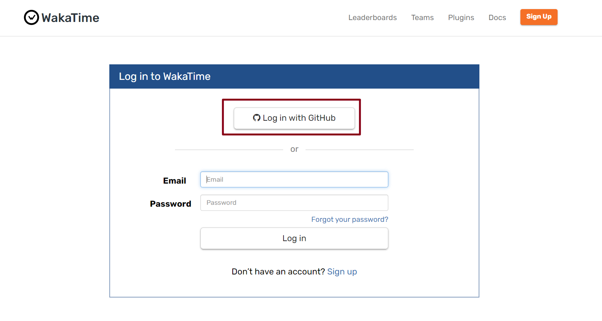
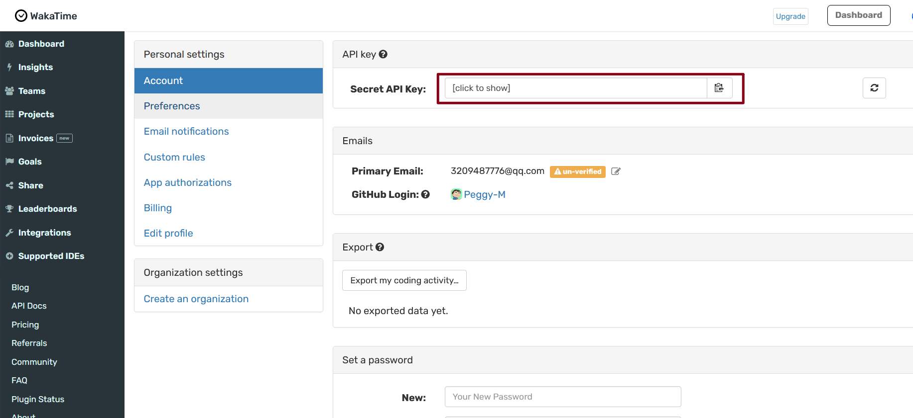
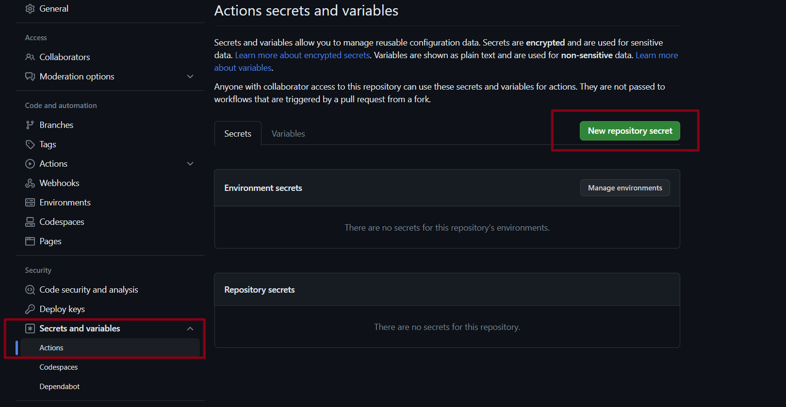
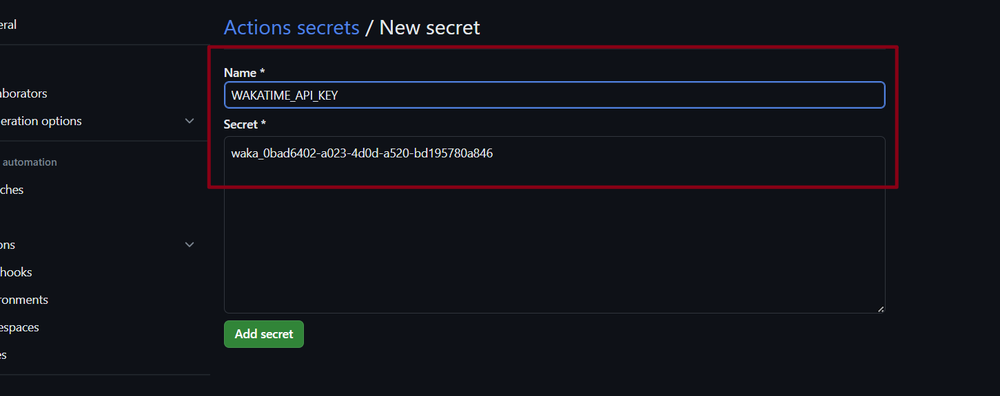
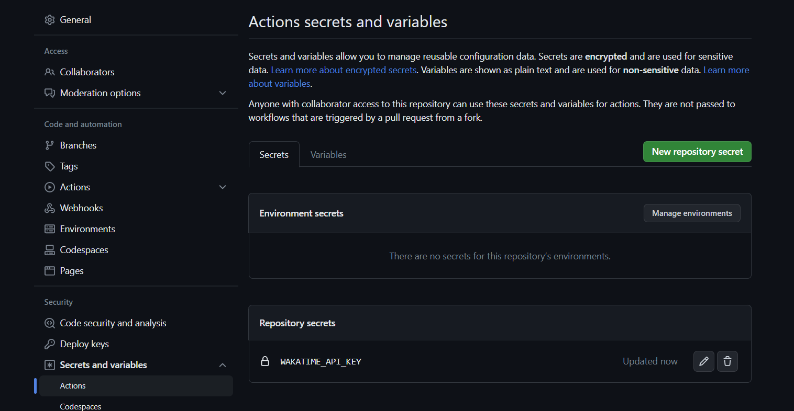
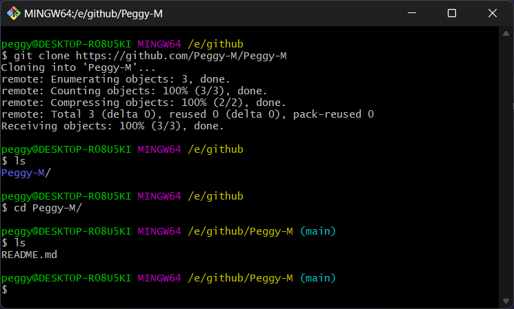

# 打造个性化的 GitHub

##  如何构建属于自己个性化的 GitHub 首页？

### 初始化主页访问仓库

- 首先创建一个仓库，仓库名与自己的 GitHub 的用户名保持一致，比如我的 GitHub 的用户名为 `Peggy-M` 那么新建的仓库地址为 `https://github.com/Peggy-M/Peggy-M` 

- 选择 `Public` 公开，并添加一个 `README.md` 文件
- 选择 `Create repository` 创建即可

可以看到当我们选择 `Add a README file` 默认添加的 `README.md` 会初始化内容

~~~ md
### Hi there 👋

<!--
**Peggy-M/Peggy-M** is a ✨ _special_ ✨ repository because its `README.md` (this file) appears on your GitHub profile.

Here are some ideas to get you started:

- 🔭 I’m currently working on ...
- 🌱 I’m currently learning ...
- 👯 I’m looking to collaborate on ...
- 🤔 I’m looking for help with ...
- 💬 Ask me about ...
- 📫 How to reach me: ...
- 😄 Pronouns: ...
- ⚡ Fun fact: ...
-->

~~~

- 此时访问主页就会看到 **Hi there** 的字样

- 所以我们要做的就是让 `Peggy-M/README.md` 文件中的内容更丰富一些

### 美化 README.md，打造  `炫酷` 的界面

### 每周代码统计

先看几个炫酷的统计图

