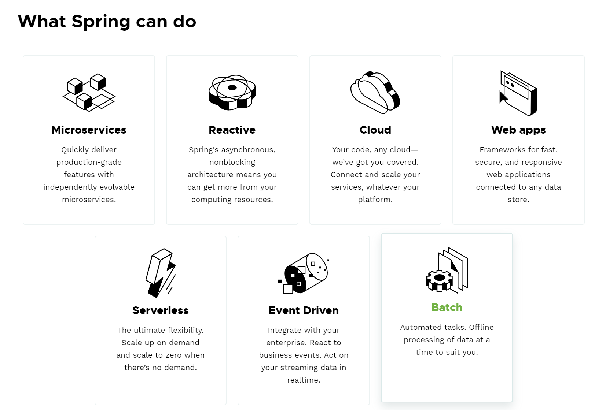
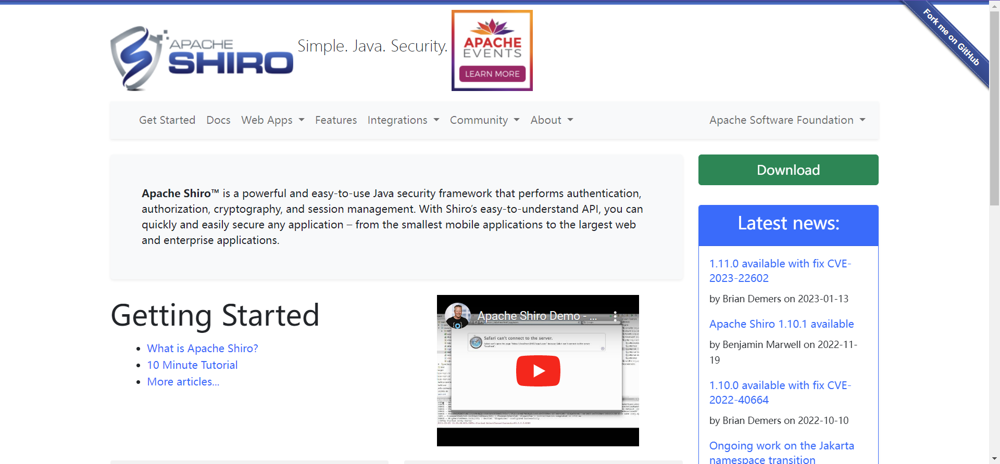
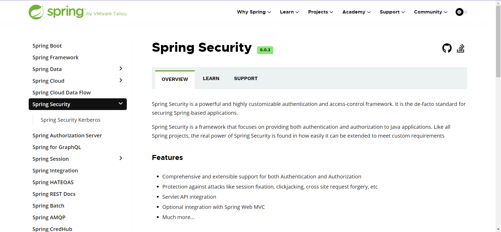
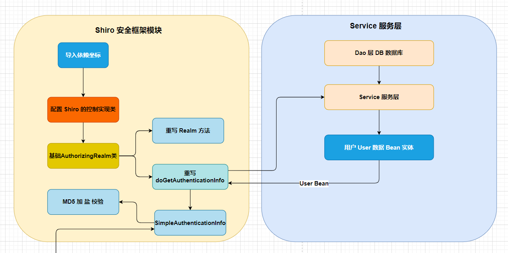
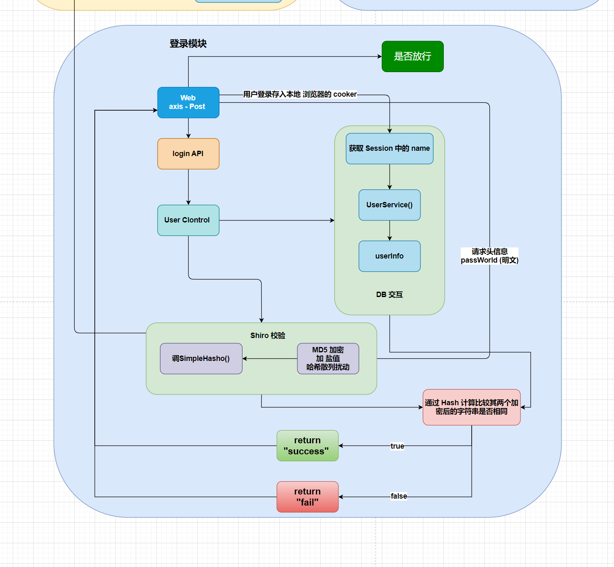
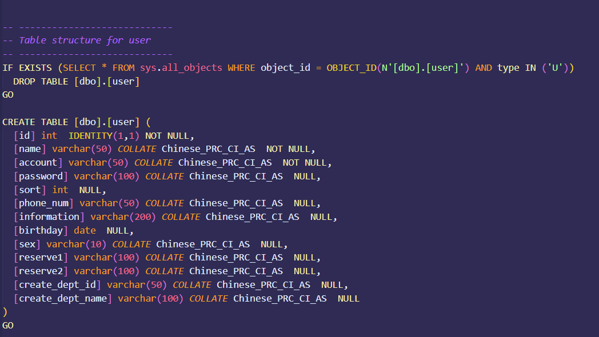

# 毕业论文

[TOC]

## 摘要

工业互联网煤流组态无人值守系统在工业中的需求程度取决于具体的行业和企业。在一些需要大量煤炭运输和处理的行业，如电力、钢铁、化工等，煤流组态无人值守系统可以提高生产效率、降低成本、减少人力资源的使用，因此需求较大。本文介绍了一种基于工业互联网的煤流组态无人值守系统的开发。该系统主要使用Java作为后端语言，并通过Java调用海康的摄像头，实现煤场的人员抓拍以及一些安全检测。本文详细介绍了系统的设计和实现过程，并对系统的性能进行了评估。

**关键词**：无人值守系统、工业互联网、Web物联网系统、Java后端、海康摄像头

## Abstract

The demand for industrial Internet coal flow configuration unmanned system in industry depends on specific industries and enterprises. In industries that require a large amount of coal transportation and processing, such as electricity, steel, and chemical industries, the coal flow configuration unmanned system can improve production efficiency, reduce costs, and reduce the use of human resources, so the demand is relatively high. However, in other industries, this type of system may not be necessary. Overall, with the continuous development and application of industrial Internet technology, the demand for unmanned systems in industry will continue to increase. This article introduces the development of an industrial Internet coal flow configuration unmanned system. The system mainly uses Java as the backend language and calls Hikvision’s camera through Java to achieve personnel capture and some safety inspections in the coal yard. This article details the design and implementation process of the system and evaluates its performance.

Keyword：Unattended system,industrial Internet, Web Internet of Things system,Java back end, Hikang camera

## 第一章 绪论

### 1.1 课题研究背景及意义

**背景**

​		Web和物联网的发展历史可以追溯到上世纪90年代。Web的发展始于1991年，当时英国的物理学家蒂姆·伯纳斯-李（Tim Berners-Lee）发明了第一个Web服务器和Web浏览器，开创了Web的发展历程。Web的出现使得人们可以通过互联网进行信息的共享和交流，极大地促进了信息技术的发展和应用。物联网的概念最早出现在1999年，当时美国麻省理工学院的自动识别实验室主任凯文·阿什顿（Kevin Ashton）提出了物联网的概念，他认为物联网是指通过互联网将物理世界和数字世界连接起来，实现物品之间的互联互通。为了实现信息的共享和交流。Web的出现使得人们可以通过互联网进行信息的共享和交流，而物联网的出现则使得物品之间可以通过互联网进行信息的共享和交流。Web和物联网的发展历程相互促进，共同推动了信息技术的发展和应用。人们对信息的获取和交流的需求越来越高，同时物品之间的互联互通也成为了人们关注的焦点。Web物联网的出现，可以实现人与物品之间的互联互通，实现信息的共享和交流，从而推动社会的发展和进步。Web物联网的背景是信息技术的发展和应用，是人们对信息获取和交流的需求，是物品之间互联互通的需求，是社会发展和进步的需要。

**意义**

​		工业互联网煤流组态无人值守系统是一种基于工业互联网技术的煤矿生产自动化系统，可以实现对煤矿生产过程的实时监控和控制，提高生产效率和安全性。工业互联网煤流组态无人值守系统的课题研究具有以下几个方面的意义：

​		提高煤矿生产效率和安全性：工业互联网煤流组态无人值守系统可以实现对煤矿生产过程的实时监控和控制，提高生产效率和安全性。通过对煤矿生产过程的实时监控和控制，可以及时发现和解决生产过程中的问题，提高生产效率和安全性。推动工业互联网技术在煤矿生产中的应用：工业互联网技术是当前工业领域的热点和趋势，具有广阔的应用前景。通过对工业互联网煤流组态无人值守系统的课题研究，可以推动工业互联网技术在煤矿生产中的应用，为煤矿生产的高效、安全、可持续发展做出贡献。

​		推动煤矿生产自动化水平的提高：煤矿生产自动化是当前煤矿生产的重要发展方向，可以提高生产效率和安全性。通过对工业互联网煤流组态无人值守系统的课题研究，可以推动煤矿生产自动化水平的提高，为煤矿生产的现代化和智能化发展做出贡献。推动煤矿企业的转型升级：当前，煤矿企业面临着转型升级的压力和挑战。通过对工业互联网煤流组态无人值守系统的课题研究，可以推动煤矿企业的转型升级，提高企业的竞争力和可持续发展能力。

### 1.2 研究方法 

​		采用了多种信息检索渠道，包括学校图书馆、北京中国和知网检索(CNKI)网站等，以获取相关代表性著作、学术论文报告等各类文献资料。对这些文献资料进行了广泛细致的系统收集，以确保收集到的资料具有更全面、客观的特点。在收集到的文献资料中，逐一进行了分类归纳或整理，以便更好地理解和分析这些资料。在正确选取文献信息的基础上，对这些研究资料进行了比较恰当的分析，以便更好地理解和解决研究问题。最终，为本项目研究及论文研究的准确撰写选题提供了足够全面的科学理论支撑。这些工作的完成，为的研究提供了坚实的基础，使能够更好地理解和解决研究问题，为研究结果的准确性和可靠性提供了保障。

### 1.3 课题研究现状

#### 1.3.1 语言架构选型

​		选择后台架构的语言，面向服务器语言市面上主要为 Java 与 Go 为主。通过对比两者在实际开发以及语言生态和实际开发应用环境的考虑，最终选定后台的开发以 Java 为主。

关于两者这件开发适宜环境以及性能生态方面见其表所示。

|                | Java                                                         | Go                                                           |
| -------------- | ------------------------------------------------------------ | ------------------------------------------------------------ |
| 特点           | 使用JVM层，确定开发者和系统调用的界限；内置自动垃圾回收算法。编程语言，到可执行汇编前，使用 *字节码* 协议；多了一层运行时 *可编辑* 的解释性语法 可执行文件终态是字节码包，可运行于任何安装了虚拟机的操作系统 线程映射至操作系统线程，JVM作为用户态应用存在于宿主机上；IO操作需要用户态到系统态的转移 | 直接编译为操作系统所需的可执行文件，可执行文件终态为汇编态；可执行文件运行于Go运行时空间，Go运行时提供自动垃圾回收，程序执行是面向CPU的任务调度 面向CPU的资源调度思想，高效、无用户态和系统态的切换，高IO效率 |
| 优缺点         | Java字节码的存在，可在运行时动态修改执行指令；为开发提供动态配置的优势，例如：注解的使用、SpringBoot的自动化配置  Java应用可在启动初始时，实现自动化配置，配置文件简单 | Go是面向CPU的任务调度，硬件使用率很高；尤其是IO操作Go编译压缩率高，同等功能实现，运行态 *占用内存小* 很多，并且直接运行（不需要类似Java的JVM） |
| 适合构建的系统 | Java适合构建流水式、日志式数据系统，业务系统；生态全面。 例如：财务系统、日志系统 | Go适合构建高IO、硬件调度类、运维辅助类； 例如：内存数据库、DevOps、视频图片处理，文件服务 |
| 判断选择依据   | 想要运行期出现问题迅速定位和解决，快速处理因软件系统导致的运营过程中的问题，请使用Java | 专注于硬件资源的使用，或解决硬件资源占用过多的问题；建议使用Go |

#### 1.3.2 服务器选型

​		市面上主流的服务主要有 Windows Server、Linux、Unix、macOS Server 等，其为了后期维护的方便性，以及降低整体上手的操作维护成本，结合实际环境最终选用微软提供的 Windows Server 服务做 为其后台系统的承载。

其具体的参考对照如下表所示。

|      系统      |                             优点                             |                             缺点                             |
| :------------: | :----------------------------------------------------------: | :----------------------------------------------------------: |
| Windows Server | 易于使用：Windows Server具有良好的用户界面和操作体验，易于安装和使用。 兼容性好：Windows Server具有良好的兼容性，能够与其他微软产品和第三方软件进行良好的集成。支持多种应用：Windows Server支持多种应用和服务，能够满足不同的应用需求。 | 价格较高：Windows Server是一种商业化的操作系统，价格较高。安全性较低：Windows Server的安全性较低，容易受到病毒和恶意攻击。 |
|     Linux      | 开源：Linux是一种开源的操作系统，用户可以自由地使用、修改和分发。 稳定性高：Linux具有高度的稳定性和可靠性，能够保证系统的稳定运行。 安全性高：Linux具有高度的安全性，能够有效地防止病毒和恶意攻击。 | 学习曲线陡峭：Linux的学习曲线较陡峭，需要一定的学习和使用经验。 兼容性较差：Linux的兼容性较差，与其他操作系统和软件的兼容性不够良好。 |
|      Unix      | 稳定性高：Unix具有高度的稳定性和可靠性，能够保证系统的稳定运行。 安全性高：Unix具有高度的安全性，能够有效地防止病毒和恶意攻击。 支持多种应用：Unix支持多种应用和服务，能够满足不同的应用需求。 | 价格较高：Unix是一种商业化的操作系统，价格较高。 学习曲线陡峭：Unix的学习曲线较陡峭，需要一定的学习和使用经验。 |
|  macOS Server  | 易于使用：macOS Server具有良好的用户界面和操作体验，易于安装和使用。 兼容性好：macOS Server具有良好的兼容性，能够与其他苹果产品和第三方软件进行良好的集成。 支持多种应用：macOS Server支持多种应用和服务，能够满足不同的应用需求。 | 功能较少：macOS Server的功能相对较少，不适用于大型企业和高性能计算等领域。 兼容性较差：macOS Server的兼容性较差，与其他操作系统和软件的兼容性不够良好。 |
|    FreeBSD     | 开源：FreeBSD是一种开源的操作系统，用户可以自由地使用、修改和分发。 稳定性高：FreeBSD具有高度的稳定性和可靠性，能够保证系统的稳定运行。 安全性高：FreeBSD具有高度的安全性，能够有效地防止病毒和恶意攻击。 | 学习曲线陡峭：FreeBSD的学习曲线较陡峭，需要一定的学习和使用经验。 兼容性较差：FreeBSD的兼容性较差，与其他操作系统和软件的兼容性不够良好。 |

#### 1.3.3 关系型数据库选型

主流的关系型数据库包括MySQL、Oracle、SQL Server、PostgreSQL等。由于选型的是微软的 Windows Server 服务器所以本身自带了其关系型数据库 SQL Server ，因此在数据库选型方面选择了 SqlServer 数据库，作为后台数据存储的载体。

关于其市面上的关系型数据库的性能对照表如下所示：

| 关系型数据库 |                             优点                             |                             缺点                             |
| :----------: | :----------------------------------------------------------: | :----------------------------------------------------------: |
|    MySQL     | 高性能：MySQL具有快速的读写速度和高效的查询性能，能够处理大量的数据。 可靠性：MySQL具有高度的可靠性和稳定性，能够保证数据的安全性和完整性。 可扩展性：MySQL支持多种扩展方式，能够满足不同规模和需求的应用场景。 开源：MySQL是一种开源的数据库管理系统，用户可以自由地使用、修改和分发。 | 处理大量数据时，性能可能会受到影响。 对于高并发的应用场景，需要进行优化和调整。 |
|    Oracle    | 高度的可靠性和安全性：Oracle具有强大的数据处理和管理能力，能够保证数据的安全性和完整性。 可扩展性：Oracle支持多种扩展方式，能够满足不同规模和需求的应用场景。 强大的数据处理和管理能力：Oracle具有强大的数据处理和管理能力，能够处理大量的数据。 | 价格较高：Oracle是一种商业化的数据库管理系统，价格较高。 对硬件要求较高：Oracle需要较高的硬件配置，对服务器的要求较高。 需要专业的管理和维护：Oracle需要专业的管理和维护，需要专业的DBA进行管理和维护。 |
|  SQL Server  | 可扩展性：SQL Server支持多种扩展方式，能够满足不同规模和需求的应用场景。 易于安装和使用：SQL Server易于安装和使用，具有良好的用户界面和操作体验。 | 处理大量数据时，性能可能会受到影响。 对于高并发的应用场景，需要进行优化和调整。 |
|  PostgreSQL  | 高度的可靠性和安全性：PostgreSQL具有强大的数据处理和管理能力，能够保证数据的安全性和完整性。 可扩展性：PostgreSQL支持多种扩展方式，能够满足不同规模和需求的应用场景。 开源：PostgreSQL是一种开源的数据库管理系统，用户可以自由地使用、修改和分发。 | 处理大量数据时，性能可能会受到影响。 对于高并发的应用场景，需要进行优化和调整。 |

#### 1.3.4 非关系型数据库选型

非关系型数据库主要是充当缓存来使用的，其主要的目的是为了让中间一些异常结果存储在缓存中，最终通过 web Socket 完成数据的上报，进行图形化的实时监控，对异常的点进行定点显示。

市面上主要有的非关系型的数据库主要有一下几种：MongoDB、Redis、Cassandra、HBase、Couchbase、Neo4j等，处于其主流行的考虑以及操作成本选择了其 Redis 做为中间缓存数据库作为异常信息的中间存储。

| 非关系型数据库 | 说明                                                         | 优点                                                         | 缺点                                                         |
| -------------- | ------------------------------------------------------------ | ------------------------------------------------------------ | ------------------------------------------------------------ |
| MongoDB        | MongoDB是一种基于文档的非关系型数据库                        | 高度的可扩展性：MongoDB支持分布式架构，能够轻松地扩展到多个节点。 灵活性高：MongoDB支持动态模式，能够灵活地处理不同类型的数据。 性能高：MongoDB具有快速的读写速度和高效的查询性能，能够处理大量的数据。 | 不支持事务：MongoDB不支持事务，可能会导致数据的不一致性。 存储空间占用较大：MongoDB的存储空间占用较大，可能会导致存储成本的增加。 |
| Redis          | Redis是一种基于内存的非关系型数据库，具有高度的性能和可靠性  | 高度的性能：Redis具有快速的读写速度和高效的查询性能，能够处理大量的数据。 可靠性高：Redis具有高度的可靠性和稳定性，能够保证数据的安全性和完整性。 支持多种数据结构：Redis支持多种数据结构，如字符串、哈希表、列表等，能够满足不同的应用需求。 | 存储空间受限：Redis的存储空间受限于内存大小，可能会导致存储空间不足的问题。 不支持持久化存储：Redis默认不支持持久化存储，可能会导致数据丢失的问题。 |
| Cassandra      | Cassandra是一种分布式的非关系型数据库，具有高度的可扩展性和容错性。 | 高度的可扩展性：Cassandra支持分布式架构，能够轻松地扩展到多个节点。 容错性高：Cassandra具有高度的容错性，能够保证数据的安全性和完整性。 性能高：Cassandra具有快速的读写速度和高效的查询性能，能够处理大量的数据。 | 学习曲线陡峭：Cassandra的学习曲线较陡峭，需要一定的学习和使用经验。 不支持事务：Cassandra不支持事务，可能会导致数据的不一致性。 |
| HBase          | HBase是一种基于Hadoop的非关系型数据库，具有高度的可扩展性和容错性 | 高度的可扩展性：HBase支持分布式架构，能够轻松地扩展到多个节点。 容错性高：HBase具有高度的容错性，能够保证数据的安全性和完整性。 性能高：HBase具有快速的读写速度和高效的查询性能，能够处理大量的数据。 | 学习曲线陡峭：HBase的学习曲线较陡峭，需要一定的学习和使用经验。 不支持事 |

#### 1.3.5 框架选型

​		框架选择 Java Web 开发生态中的 Spring 系列，通过 SpringBoot 快速构建基础项目，Spring是一个开源的Java框架，它提供了一系列的工具和组件，用于简化Java应用程序的开发。Spring框架的核心是IoC（Inversion of Control）和AOP（Aspect Oriented Programming）两个概念。IoC是一种设计模式，它将对象的创建和依赖关系的管理交给容器来完成，从而实现了对象之间的解耦。Spring框架通过IoC容器来管理对象之间的依赖关系，使得应用程序的开发更加灵活和可扩展。AOP是一种编程范式，它通过将横切关注点（如日志、事务、安全等）从业务逻辑中分离出来，实现了代码的重用和模块化。Spring框架通过AOP机制来实现横切关注点的管理，使得应用程序的开发更加简洁和易于维护。

​		除了IoC和AOP，Spring框架还提供了一系列的组件和工具，如Spring MVC、Spring Data、Spring Security等，用于简化Web应用程序、数据访问、安全管理等方面的开发。Spring框架的优点包括：

​		简化开发：Spring框架提供了一系列的工具和组件，用于简化Java应用程序的开发。

​		提高效率：Spring框架通过IoC和AOP机制，实现了对象之间的解耦和横切关注点的管理，从而提高了开发效率。

​		提高可维护性：Spring框架的组件和工具具有高度的可扩展性和可维护性，使得应用程序的维护更加简单和方便。

。[Spring 官网](https://spring.io/)

#### 1.3.6 摄像头选型

​		摄像头是完成 AI 布放人员监控，煤流监控的主要模块，所以摄像头的选型必须符合其具有 AI 模块，能够适用于环境较为恶劣的状况，还必须提供其大量丰富的系统对接开发模块等。处于综合考虑适用其海康威视的摄像头作为其具体的硬件选型。

海康威视摄像头其主要有以下有点：

1. 功能丰富：海康威视摄像头提供的SDK具有丰富的功能，包括视频采集、视频编码、视频解码、视频播放、云台控制、报警处理等，能够满足不同应用场景的需求。
2. 易于集成：海康威视摄像头提供的SDK具有良好的兼容性和易用性，能够方便地集成到不同的应用程序中。
3. 高度的稳定性和可靠性：海康威视摄像头提供的SDK经过严格的测试和验证，具有高度的稳定性和可靠性，能够保证应用程序的正常运行。
4. 支持多种平台和开发语言：海康威视摄像头提供的SDK支持多种平台和开发语言，如Windows、Linux、Android、iOS等，能够满足不同开发者的需求。
5. 提供完善的技术支持和文档：海康威视摄像头提供的SDK提供了完善的技术支持和文档，包括开发指南、API文档、示例代码等，能够帮助开发者快速上手和解决问题。

### 1.4 本文研究内容

​		基于 SpringBoot 框架配合关系型中间数据库 SQL Server 与 非关系型数据库 Redis 开发其部署运作在 WidowsService 服务器上的物联网无人值守的监控平台系统，其主要的功能大都体现在其通过后端调用其海康威视的摄像头，进行其摄像头的抓拍以及异常状况的分析，完成异常数据的上报，以及基础模块，例如摄像头的配置，视屏异常日志的查询，设别列表的实时监测。

​		基于 Spring 的物联网无人值守系统系统研究后端设计：主体采用 Spring 框架基础，后端采用 Spring Boot 与 持久数据库 SQL Server 和中间缓存数据库 Redis ，通过海康摄像头的调用完成对摄像头设备的登录与抓拍的功能实现，对于 AI 与 HR 高清摄像头通过不同的方式具体调用实现，将其异常的数据通过上报的形式返回其 Redis 客户端，通过服务端的 WebSocket 将本地的数据进行上报，在 Web 界面展示其异常的上报数据，其完成整个顺煤流组态的布放展示。

其功能模块主要有以下几块：

#### 1.4.1 用户模块：

##### 1.4.1.2 登录模块

通过 [Apache Shior](https://shiro.apache.org/) 安全框架作为其主要的用户安全校验拦截的模块，防止非指定用户的强行非法访问。

其Apache Shiro 是一款功能强大易于使用的 Java 安全框架，其像这样的框架比如有 Spring 家族的[Spring Security ](https://spring.io/) 框架。

 

两者对比其主要体现在使用成本以及其角色访问的灵活度之上，两者的优缺点对比主要有以下区别：

| 安全框架        | 优点                                                         | 缺点                                                         |
| --------------- | ------------------------------------------------------------ | ------------------------------------------------------------ |
| shiro           | 简单易用：Shiro的API设计简单易用，学习曲线较低，可以快速集成到应用程序中。 灵活性高：Shiro的设计目标是灵活性高，可以根据应用程序的需求进行定制和扩展。 轻量级：Shiro的代码量较少，不依赖于其他框架，可以轻松地集成到任何Java应用程序中。 支持多种认证方式：Shiro支持多种认证方式，如用户名密码认证、LDAP认证、OAuth认证等。 | 社区活跃度较低：Shiro的社区活跃度较低，更新速度较慢，可能会存在一些安全漏洞。 功能相对较少：Shiro的功能相对较少，不如Spring Security提供的功能丰富。 |
| Spring Security | 功能丰富：Spring Security提供了丰富的安全功能，如基于角色的访问控制、方法级别的安全控制、防止CSRF攻击等。 社区活跃度高：Spring Security的社区活跃度高，更新速度快，可以及时修复安全漏洞。 支持多种认证方式：Spring Security支持多种认证方式，如用户名密码认证、LDAP认证、OAuth认证等。 | 学习曲线较高：Spring Security的API设计较为复杂，学习曲线较高。 依赖于Spring框架：Spring Security依赖于Spring框架，如果应用程序不使用Spring框架，集成起来可能会比较麻烦。 |

处于其灵活度与使用的成本，最终选定 shiro 作为其安全模块的框架。

关于登录模块的其具体流程如下：

##### 1.4.1.2 用户管理模块

​		用户管理模块主要分为管理员与普通员工，对于管理员则是开放了所有的权限，包括基本用户信息（个体用户增删改查，基本信息的修改）的管理以及设备的管理（设备的增删改查）。其关于普通用户与管理员级别的用户主要是通过 shiro 框架提供的用户的管理权限部分实现。在其 shiro 官网提供的参考手册中指出，通过配置其 shiroFilterChainDefinition （shiro 过滤拦截管理器）方法可实现指定用户的页面放行。

###### 1.4.1.2 数据库设计

 

用户数据库的设计主要是从用户的职能出发，其具体的对象关系如下标所示：

| 字段以及属性               | 字段名       | 作用                                                         |
| -------------------------- | ------------ | ------------------------------------------------------------ |
| [id]  int                  | 用户 id      | 用户的唯一标识,主键是一种唯一标识符，用于标识数据库表中的每一行数据。用户的id作为主键可以确保每个用户在数据库中都有唯一的标识符，方便进行数据的查询、更新和删除操作。此外，用户的id还可以作为外键使用，与其他表进行关联，如用户部分，操作日志等信息。 |
| [name] varchar             | 用户名       | 用于用户信息以及后台信息记录，该名是用户的真实名             |
| [account] varchar          | 用户账户名   | 用户的匿名，该名不可以重复，其具有唯一性，主要用户其登录界面的登录 |
| [passworld] varchar        | 用户密码     | 用户的密码是通过 shiro 框架，进行了 MD5 加盐加密，是一个加密后的字符串，目前是无法通过逆向解析破译。 |
| [information] varchar      | 用户消息     | 用户的异常提醒消息                                           |
| [birthday] date            | 用户创建时间 | 用户第一次注册的时间，主要用于一些特殊场合更具用户的注册时间进行特定用户的筛选 |
| [sex] varchar              | 用户性别     | 用户的性别                                                   |
| [reserve1] varchar         | 备注1        | 保留字段，用户日后特性信息的处理                             |
| [reserve2] varchara        | 备注2        | 保留字段，用户日后特性信息的处理                             |
| [create_dept_id] varchar   | 部门id       | 用户所属的具体部门的外键，主要用户进行关联查询               |
| [create_dept_name] varchar | 部门名       | 用户所属的具体部门                                           |

#### 1.4.2 设备管理模块

##### 1.4.2.1 摄像头硬件管理

##### 1.4.2.2 传感器硬件管理

##### 1.4.2.3 其他管理

#### 1.4.3 布放系统

分类

##### 1.4.3.1 异常传感器布放

##### 1.4.3.2 异常视频监控布放

- AI 布放模块
- HR 高清抓拍

#### 1.4.4 异常日志系统

##### 1.4.4.1 传感器异常上报

##### 1.4.4.2 摄像头抓拍上报

- AI 异常上报
- HR 高清抓拍上报

