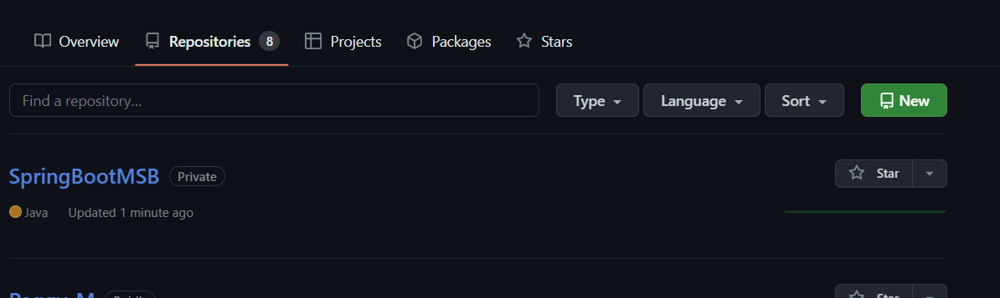

# 计划

## 3-28

今日所学内容： Redis 缓存数据库
总结：目前 Redis 缓存数据库与 JVM 调优都看了一遍，但在整个 Redis 学习过程中没有做什么笔记，一些难点还需花一些精力好好去实践，这周末要尽量完成 redis 与 JVM 这一块的知识整理，形成自己的知识体系框架
遇到的问题：感觉很多东西都需要大量的实操才能理解深刻，有一些较多的知识点，如果要掌握就需要花费较多的时间去实践
是否解决：解决
建议：无
用时大概多久：昨天一些事情耽搁学习，不足 5 个小时

## 3-29

今日所学内容： 2022金九银十 MySql 面试题 MySql 实战调优（一、二）

总结：MySql 这一章节比其他的课程理解与接受起来都比较吃力，感觉一个视频有时候得刷好几遍才能对一些点有理解

遇到的问题：自己感觉时间有点不够用

是否解决：否

用时大概多久：学习加巩固 4 小时左右

## 3-30

今日所学内容： SpringCloud Alibaba 实战与源码深入剖析 MySql 面试题 MySql 实战调优（三四）

总结：记录博客，分布式这一块由于长时间没有做过，自己遍动手跟了一遍，花费了点时间。

遇到的问题：目前没有

是否解决：否

用时大概多久：视频学习加操作记录 6 个多小时

## 4-1

今日所学内容： 多线程与高并发 1-20   SpringCloud Alibaba 实战与源码深入剖析 （五六）

总结：学习多线程高并发部分，复习 Redis 知识点，SpringCloud 跟着视频代码实战

遇到的问题：目前没有

是否解决：否

用时大概多久：学习 4 个小时

## 4-4

今日所学内容：SpringCloud Alibaba 实战与源码深入剖析 （五六）Linux 环境搭建-后端代码测试

总结：环境搭建比较折腾，内容都比较简单，感觉没什么难的

遇到的问题：目前没有

是否解决：否

用时大概多久：学习 4 个多小时

## 4-6

今日所学内容：SpringCloud Alibaba 源码分析

总结：源码有点难，这一块可能要花费的时间要比较多一点

遇到的问题：目前没有

是否解决：否

用时大概多久：学习 4 个小时

# 4-10

今日所学内容：SpringCloud Alibaba 源码分析

遇到的问题：对源码部分感觉存在较多疑惑的点，需要将一个视频点多看几遍，并请上手自己去总结一遍才能转化成自己的东西。

是否解决：否

用时大概多久：学习 4.5 个小时

